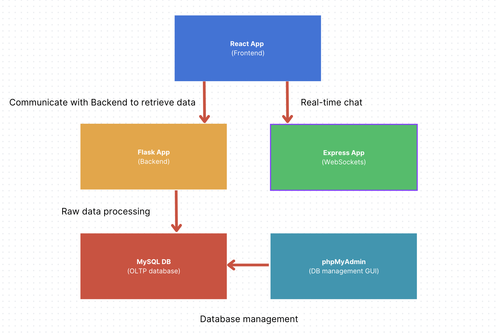

# Sprints (DevOps Tool for students)

Sprints is a comprehensive DevOps software platform designed for students who are new to agile methodologies and want to practice them in their software development projects. It offers a suite of Agile resources to assist teams in planning, tracking, and delivering working software efficiently. With features such as task board, story poker, chatroom and educational resources, Sprints helps students in facilitating collaboration within development teams.

## Key feature

* Task board: Visualize and track work using customizable boards.
* Story poker: Estimate the effort required for each user story as a team
* Chatroom: Communicate and gather feedback anonymously 
* Educational resources: Explain Agile methodologies with detailed reference

## Target Audience

Our primary focus is on students who need to build software projects but may lack experience or knowledge of Agile methodologies. This includes teams in project-focused classes, hackathons, and small businesses. Additionally, Sprints can be used by professional teams seeking to adopt Agile practices in their projects.

# Project Structure



# Build 

To get started with the project, follow the steps below:

1. Clone the repo

```
git clone https://github.com/ZejunZhou/Sprints
```

After switching to the project directory

2. Build the Docker containers:

```
docker compose build
```

3. Run the containers in the background

```
docker compose up -d
```

4. You can stop and remove the containers at anytime by 

```
docker compose down
```

# Access

Open your web browser and visit http://localhost:3000 to interact with the frontend.


